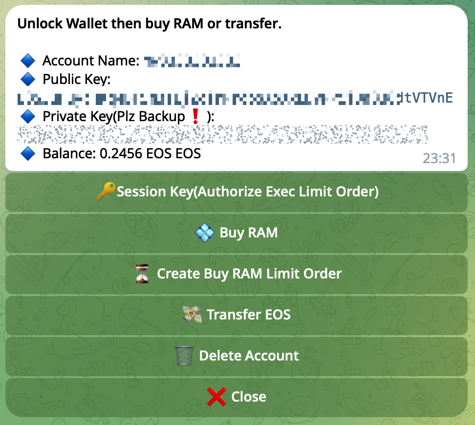
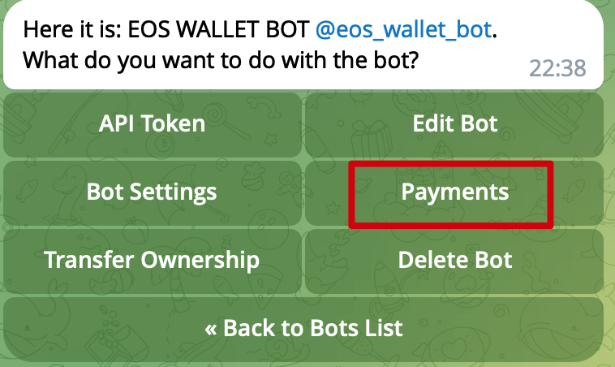

# EOS WALLET BOT
### The current private key encryption scheme is very weak and only suitable for small-capital testing. Welcome to submit PR.



Nodejs v20.11.0


## 1. Apply the telegram bot key from [@BotFather](https://t.me/BotFather)


## 2. Set up Node.js Enviroment

Nodejs v20.11.0

## 3. Apply [stripe](https://stripe.com) and bind provider in [@BotFather](https://t.me/BotFather) (optional)

more infomation about telegram payment : https://core.telegram.org/bots/payments


## 4. Start the bot
```
yarn
 
yarn build && yarn start

# run ramOrderProcessor
yarn start-ram-processor
 
# or 

yarn dev

https://t.me/eos_mommmy_bot
```


## 5. account create contract

https://github.com/cppfuns/signdappplay


## Others

```
# delete the db files in history
git filter-branch --force --index-filter 'git rm --cached --ignore-unmatch useruser_data.db' --prune-empty --tag-name-filter cat -- --all

git reflog expire --expire=now --all
git gc --prune=now --aggressive

git push --force --all

```